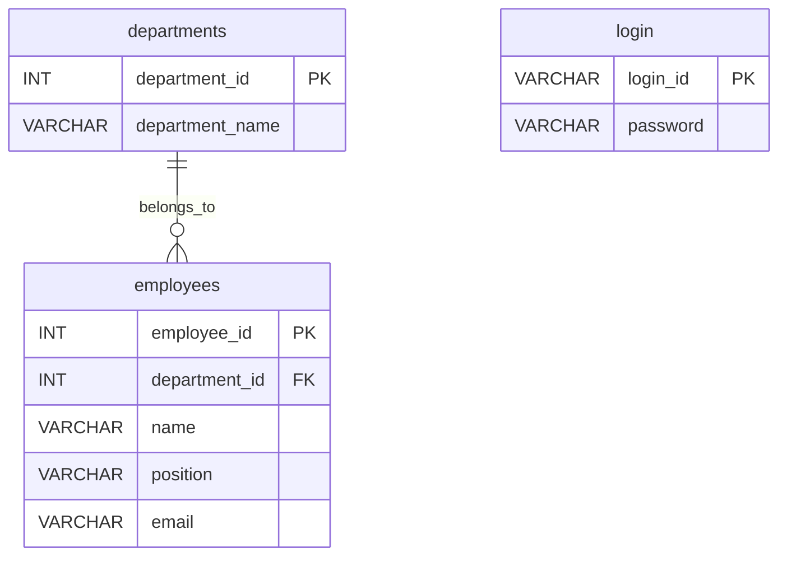
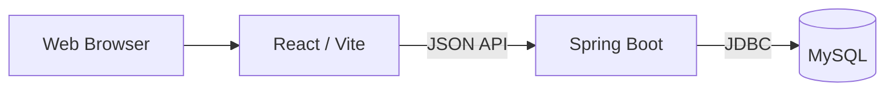
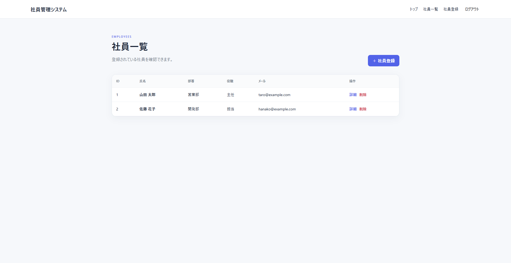
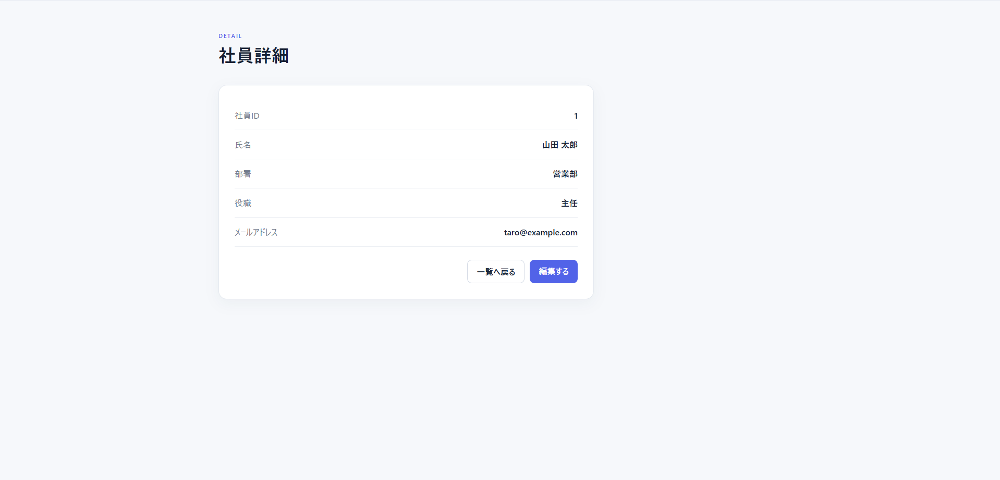
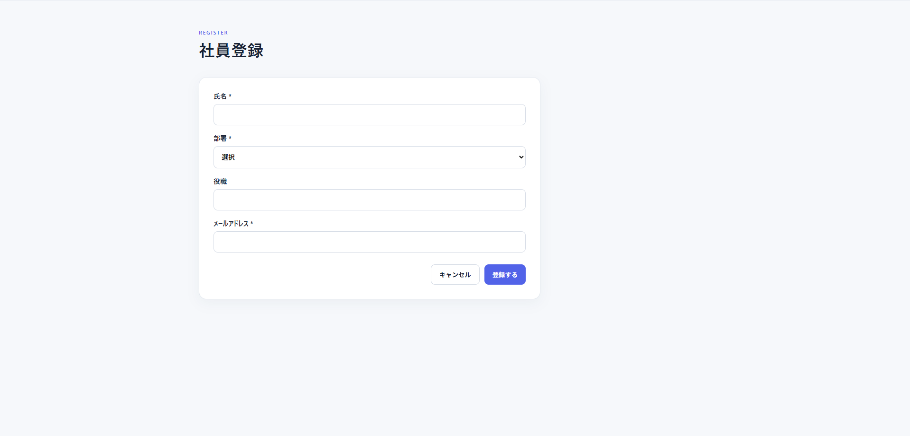

# 社員管理システム

> 社員情報の登録・確認・編集・削除をシンプルに行える、管理者向けWebアプリケーション。

## 概要

管理者がログインし、社員情報を一元管理するWebアプリです。

ログイン → トップページ → 社員一覧／社員登録の流れで操作できます。

## テストアカウント

- ID: `admin`
- Password: `admin123`

## 主な機能

- ログイン／ログアウト
- トップページ
- 社員一覧
- 社員詳細
- 社員登録
- 社員編集
- 社員削除
- 未ログイン時のアクセス制御
- 入力チェック

## 画面遷移

```text
ログイン
  ↓
トップページ
  ├─ 社員一覧
  │    └─ 社員詳細
  │          └─ 社員編集
  └─ 社員登録

ログアウト → ログイン
```

## 使用技術

| 分類 | 技術 |
|---|---|
| Frontend | React / Vite / JavaScript / CSS |
| Backend | Java 21 / Spring Boot / Spring JDBC |
| Database | MySQL 8 |
| 開発環境 | VS Code / Git / GitHub |
| DB起動 | Docker Compose |

## ER図



## システム構成



## API

| Method | URL | 内容 |
|---|---|---|
| POST | `/login` | ログイン |
| POST | `/logout` | ログアウト |
| GET | `/employees` | 社員一覧 |
| GET | `/employees/{id}` | 社員詳細 |
| POST | `/employees` | 社員登録 |
| PUT | `/employees/{id}` | 社員編集 |
| DELETE | `/employees/{id}` | 社員削除 |

## ローカル起動方法

### 必要環境

- Node.js
- Java 21
- Maven
- Docker Desktop

### 1. MySQLを起動

プロジェクト直下で実行します。

```bash
docker compose up -d
```

### 2. Backendを起動

新しいターミナルで実行します。

```bash
cd backend
mvn spring-boot:run
```

### 3. Frontendを起動

さらに新しいターミナルで実行します。

```bash
cd frontend
npm install
npm run dev
```

ブラウザで `http://localhost:5173` を開きます。

### ログイン

```text
ID: admin
Password: admin123
```

## スクリーンショット

### ログイン画面


### トップページ


### 社員一覧



### 社員詳細



### 社員登録



## GitHubへ公開

```bash
git init
git add .
git commit -m "Initial commit"
git branch -M main
git remote add origin YOUR_GITHUB_REPOSITORY_URL
git push -u origin main
```

提出時はリポジトリを **Public** に設定します。

## 提出前確認

`docs/submission-checklist.md` を確認してください。
